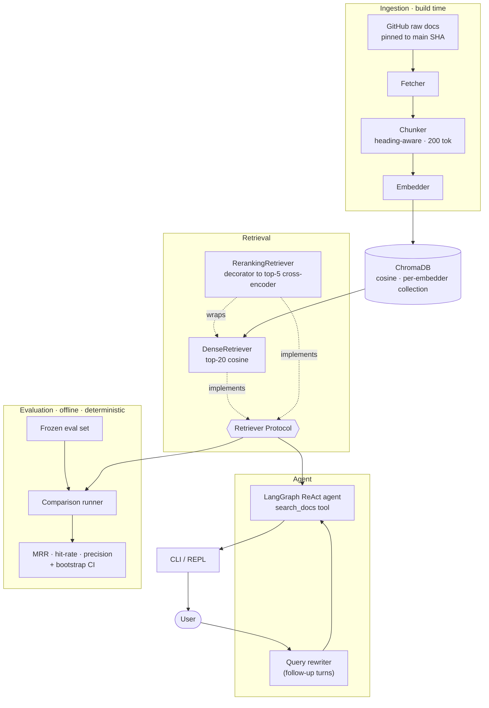

# HF RAG Agent

A question-answering agent over the Hugging Face Transformers docs. You ask it things in plain language; it retrieves the relevant doc chunks, answers, and handles follow-up questions and multi-hop chains (the kind where the answer is spread across a task guide, the Trainer reference, and the PEFT guide). I also wrote a related **[Blog Post](https://github.com/vitorlecio/hf_rag_agent/blog_post.md)**.

The part I find more interesting is what happened when I tried to make retrieval "better." I added cross-encoder reranking expecting the usual lift, and on my eval set it made things consistently worse. So the agent ships with reranking off, and the section below explains it.

Built with LangGraph and ChromaDB: dense retrieval with an optional rerank stage, GPT-4.1-mini as the generator. The whole thing runs on a laptop.



---

## Reranking made retrieval worse

The reasoning for adding a reranker seemed solid. General-purpose embedders are trained mostly on natural-language similarity, so a code snippet can land in a different part of embedding space than the prose explaining it (the same modality gap people document between text and image embeddings in CLIP). A cross-encoder attends jointly over the query and the chunk instead of comparing fixed vectors, so it looked like the right fix.

It wasn't. On the 320-item frozen eval set, plain dense retrieval beats dense+rerank on every metric:

| Metric | Dense (k=5) | Rerank (k=5) |
|---|---|---|
| MRR | 0.795 [0.759, 0.829] | 0.712 [0.671, 0.755] |
| Hit Rate | 0.950 [0.925, 0.972] | 0.853 [0.819, 0.894] |
| Precision@k | 0.190 [0.185, 0.194] | 0.171 [0.164, 0.179] |

I split the eval set by chunk type to see where the damage was:

| Slice | Dense MRR | Rerank MRR | Drop from reranking |
|---|---|---|---|
| Code-containing (n=211, 66%) | 0.773 [0.731, 0.814] | 0.652 [0.596, 0.701] | −0.121 |
| Pure-prose (n=109, 34%) | 0.837 [0.775, 0.890] | 0.829 [0.765, 0.892] | −0.008 |

The modality gap is real: code chunks are harder to retrieve than prose for both methods. But reranking hurts the code chunks far more than the prose ones, the opposite of what the cross-attention theory predicted. The theory was half right and the fix was wrong.

One caveat I want to be upfront about, because it changes how much to read into this. The eval set was built by asking gpt-4.1-mini for one question per chunk, straight from that chunk's text, so the questions tend to reuse the source chunk's wording. That plays to a bi-encoder's strengths and leaves the reranker little to do, since it only reorders the top 20 dense hits and can't recover anything dense missed. The result is real and it sets the default, but it describes this eval set's query style, not reranking in general. A harder, paraphrased eval set is the experiment I'd run next.


## Demo

A real two-turn session (`uv run hf-chat`), showing multi-hop retrieval on the first turn and query rewriting picking up an implicit reference on the second:

**You:** How do I apply LoRA with PEFT and then quantize the model with bitsandbytes?

**Agent:** To apply LoRA with PEFT:

1. Install PEFT:
   ```
   pip install -U peft
   ```
2. Load your model and create a LoRA config, then add the adapter to the model:
   ```python
   from peft import LoraConfig, TaskType
   from transformers import AutoModelForCausalLM

   model = AutoModelForCausalLM.from_pretrained("your-model-name")

   lora_config = LoraConfig(
       task_type=TaskType.CAUSAL_LM,
       inference_mode=False,
       r=8,
       lora_alpha=32,
       lora_dropout=0.1,
   )

   model.add_adapter(lora_config, adapter_name="my_adapter")
   ```

For quantizing the model with bitsandbytes:

1. Use `BitsAndBytesConfig` when loading the model to quantize it in 4-bit or 8-bit:
   ```python
   from transformers import AutoModelForCausalLM, BitsAndBytesConfig

   quantization_config = BitsAndBytesConfig(load_in_4bit=True)  # or load_in_8bit=True

   model = AutoModelForCausalLM.from_pretrained(
       "your-model-name",
       device_map="auto",
       quantization_config=quantization_config
   )
   ```

You can combine these by first loading the quantized model and then adding the LoRA adapter with PEFT.

This information is from the Parameter-efficient fine-tuning and Bitsandbytes Quantization Examples sections.

---

**You:** What if I wanted to use GPTQ instead, would the PEFT setup change?

**Agent:** The PEFT setup does not fundamentally change when using GPTQ for quantization instead of bitsandbytes. You still create and add LoRA adapters with PEFT as usual.

However, GPTQ requires installing the GPT-QModel package and setting up a `GPTQConfig` for quantization, which involves specifying the number of bits, a calibration dataset, and a tokenizer.

You would quantize the model using `GPTQConfig` and then apply PEFT LoRA adapters on top of the quantized model.

So, the main difference is in the quantization step and dependencies, but the PEFT adapter setup remains the same.

This is based on the GPTQ and Parameter-efficient fine-tuning sections.

The second question never mentions LoRA, PEFT, or bitsandbytes by name. `rewrite_query()` condenses turn one into a standalone question before retrieval runs, which is what lets the agent connect "GPTQ instead" back to the original setup.

---

## How it's put together

```
src/hf_rag/
  ingestion/   Fetcher → Chunker → Embedder (ChromaDB-backed)
  retrieval/   DenseRetriever, RerankingRetriever (decorator over Dense), both implement the Retriever Protocol
  eval/        frozen eval-set generation, MRR / hit-rate / precision, bootstrap CI, comparison runner
  agent/       LangGraph agent, search_docs tool, system prompt, follow-up query rewriter
  chat/cli.py  interactive REPL
notebooks/     corpus inspection; retrieval eval (unchunked vs chunked, OpenAI vs local, dense vs rerank)
tests/         pytest, unit tests only (no LLM-behavior tests)
```

The piece that ties it together is the `Retriever` Protocol. `DenseRetriever` and `RerankingRetriever` both implement it, reranking is just a decorator wrapping dense, and the agent only ever sees the Protocol. Switching strategies is `build_agent(use_reranking=True)` with no change to agent code, which is also what makes the dense-vs-rerank comparison a clean one-variable swap.

## Running it

```bash
uv sync
# .env: OPENAI_API_KEY=...   (optional: GITHUB_TOKEN)
uv run hf-fetch    # pin upstream docs at the current main SHA and download
uv run hf-chunk    # heading-aware, token-budgeted chunking
uv run hf-embed    # embed into ChromaDB (OpenAI or local MiniLM)
uv run hf-eval     # dense-vs-rerank comparison with bootstrap CIs
uv run hf-chat     # interactive REPL
uv run pytest      # tests
```

See [CONTRIBUTING.md](CONTRIBUTING.md) for project layout, code conventions, and how the corpus/eval set get regenerated together.
## Design notes

The decisions worth explaining, roughly in pipeline order. A few were driven by keeping everything runnable on one laptop, which I'd rather say plainly than dress up.

**Ingestion.** `Fetcher` pins the docs to the current `main` commit SHA and pulls each page from `raw.githubusercontent.com` at that commit, so a fetch is reproducible even as the docs move. The corpus is 16 hand-picked pages, not a crawl: one coherent training → PEFT → quantization chain plus a spread of task guides, small enough to index and eval in minutes.

**Chunking** was the fiddliest part of the whole project, more than the agent. Pages split on `##`/`###` headings, then token-split within a section to a 200-token budget (MiniLM's tokenizer) with zero overlap. Zero overlap is on purpose: each chunk is one clean unit for eval labeling, where overlap would smear a single answer across several "relevant" chunk IDs and muddy MRR. Tables are kept whole, since splitting one destroys it, and code-mixed sections split at fenced-code boundaries and then merge prose and code back up to the budget. That last bit was iterative: my first "any code section is atomic" version left 71% of chunks over budget (the worst was 2712 tokens, way past MiniLM's ~256 truncation point); the fence-aware rewrite brought it to 17%. Adding the heading prefix below pushed it back up to 23.4%, which I accepted for the retrieval gain.

**Heading prefix.** Every chunk is embedded as `# {page_title}\n## {heading}\n\n{content}`. Originally the section heading lived only in metadata and never reached the embedding, so pure-code chunks had no natural-language anchor beyond the page title. (`MarkdownHeaderTextSplitter` keeps the heading line on a section's first piece only, so I strip it and re-add it to every piece.) Re-chunking moved the corpus from 325 to 320 chunks, so I regenerated the embeddings and eval set to match. It lifted dense code-chunk MRR from 0.735 to 0.773.

**Cosine, set explicitly.** ChromaDB defaults to L2 distance. Left unset, the `score = 1.0 - distance` conversion would have produced quietly wrong similarities. This is the kind of one-line default that can invalidate an entire eval without ever throwing an error, so it earns a call-out: collections are created with `hnsw:space=cosine`.

**Two embedders.** `EMBEDDING_CONFIG` switches between `text-embedding-3-small` (OpenAI, the default, ~$0.02/1M tokens) and `all-MiniLM-L6-v2` (local, free, small enough to run and fine-tune on a laptop), each in its own collection so they can be compared. MiniLM's 256-token cap is the tighter of the two, which is what fixes the 200-token chunk budget: one corpus, usable by every config.

**Retrieval and eval.** `DenseRetriever` pulls the top 20 by cosine; `RerankingRetriever` reranks to the top 5 with `cross-encoder/ms-marco-MiniLM-L-6-v2`, and ships off by default for the reasons up top. The eval set (query plus relevant chunk IDs) is generated once via gpt-4.1-mini and frozen to `data/eval_set.json` so the numbers stay comparable; it's regenerated only when the corpus changes. MRR is the headline metric alongside hit rate and precision@k, with seeded bootstrap confidence intervals, since point estimates on a set this size would be misleading on their own.

**Follow-up rewriting.** Before a follow-up reaches the agent, `ask()` condenses the conversation plus the new question into one standalone query. It sits outside the ReAct loop on purpose: the agent already sees full history when it forms a `search_docs` call, so the separate rewrite is there to guarantee a self-contained query rather than hope the model produces one. It's skipped on the first turn, and the tradeoff is that the rewritten question, not the original, is what gets stored for that turn.

## Limitations

Things I know about and chose not to fix yet:

- The eval set's questions echo their source chunks (see the caveat above), which flatters dense retrieval and under-tests reranking. A paraphrased eval set is the fix.
- When a section splits into a short prose chunk and a separate code chunk, nothing rejoins them at query time. It affects about 6% of multi-chunk sections; force-merging would just bring back the over-budget problem.
- The code-vs-prose split uses a crude heuristic (whether the chunk contains a fenced block), not hand-labeled ground truth.


## Further Reading
Kamath, U., Keenan, K., Somers, G., Sorenson, S. (2024). Retrieval-Augmented Generation. In: Large Language Models: A Deep Dive. Springer, Cham. https://doi.org/10.1007/978-3-031-65647-7_7
