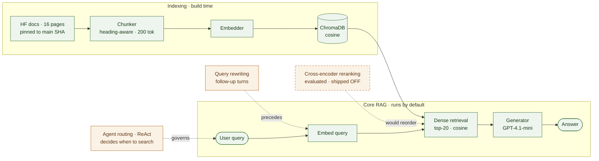

# Building a RAG agent over the Hugging Face docs (and why I shipped reranking turned off)

This is a question-answering agent over the Hugging Face Transformers documentation. You ask it something in plain language — *"how do I apply LoRA with PEFT and then quantize with bitsandbytes?"* — and it retrieves the relevant doc chunks, answers, and handles follow-up questions and multi-hop chains, the kind where the answer is spread across a task guide, the Trainer reference, and the PEFT guide.

The part I find most interesting is not that it works. It is what happened when I tried to make retrieval *better*. I added cross-encoder reranking expecting the usual lift, and on my evaluation set it made things consistently worse. So the agent ships with reranking off, and a large part of this post is about why — because the reason turned out to be more instructive than a clean win would have been.

The whole thing is built with LangGraph and ChromaDB: dense retrieval with an optional rerank stage, GPT-4.1-mini as the generator. It runs on a laptop.

## The shape of the system

The colour key: green is the core RAG pipeline — the part every RAG system has, and the part this one runs by default. Amber is the enhancement modules I considered for this project. The agent and the query rewriter are kept; cross-encoder reranking (dashed) was evaluated and shipped off.

The application is a good fit for an *agentic* RAG rather than a rigid pipeline. A user turn can be a greeting or a vague comment that needs no retrieval at all, or it can be a precise question about a default argument in a Hugging Face method. A rigid pipeline retrieves on every turn regardless; an agent decides when and how to use the search tool, which keeps retrieval where it helps and avoids dragging irrelevant context into a simple exchange.

**Methodological note.** An agent is a lightweight form of routing. Every enhancement module you add — reranking, query rewriting, hybrid search — buys some capability at the cost of latency, money, and one more thing that can fail. The agent is the cheap way to decide *which* of those modules to spend on for a given query, instead of paying for all of them on every turn.

## Building the index

> **In my project.** The corpus is 16 hand-picked pages, not a crawl: one coherent training → PEFT → quantization chain, plus a spread of task guides. The fetcher pins the docs to the current `main` commit SHA and pulls each page from `raw.githubusercontent.com` at that commit, so a fetch is reproducible even as the upstream docs move. Sixteen curated pages is small enough to index and evaluate in minutes, which matters when you want to re-run an experiment twenty times.

**Methodological note.** Corpus curation is the cheapest robustness lever there is. Removing changelogs, licences, contributing pages, and auto-generated reference dumps cuts retrieval noise before any model sees it — fewer near-duplicate chunks competing for the top-k slots. The same logic extends to source trust, authority, freshness, and deduplication once the corpus is large enough to need it.

## Chunking

Chunking was the fiddliest part of the whole project — more so than the agent. The aim is for each chunk to be one self-contained, coherent unit, so its embedding represents a *thing* rather than half of two things. That helps retrieval (cleaner embeddings) and it helps generation — it is enough to imagine a chunk handed to the generator with a table cut down the middle.

> **In my project.** Pages split on `##` / `###` headings, then I token-split within a section to a 200-token budget (measured with MiniLM's tokenizer) with **zero overlap**. The zero overlap is deliberate: each chunk is one clean unit for evaluation labelling, where overlap would smear a single answer across several "relevant" chunk IDs and muddy the retrieval metrics. Tables are kept whole — splitting one destroys it — and code-mixed sections split at fenced-code boundaries, then merge prose and code back up to the budget.
>
> That last part was iterative, and the numbers are the honest record of it. My first version treated any code section as atomic and left 71% of chunks over budget — the worst was 2712 tokens, well past MiniLM's ~256-token truncation point, so under that embedder the tail of those chunks was silently never embedded. The fence-aware rewrite brought it to 17%. Adding the heading prefix below pushed it back up to 23.4%, which I accepted in exchange for the retrieval gain.

**The heading prefix.** Every chunk is embedded as `# {page_title}\n## {heading}\n\n{content}`. Originally the section heading lived only in metadata and never reached the embedding, so a pure-code chunk had no natural-language anchor beyond the page title. Re-adding the heading to every piece lifted dense code-chunk MRR from 0.735 to 0.773. (`MarkdownHeaderTextSplitter` keeps the heading line only on a section's first piece, so I strip it and re-attach it to every piece.) Re-chunking moved the corpus from 325 to 320 chunks, so I regenerated the embeddings and the evaluation set to match.

**Methodological note.** Structure-aware chunking is a principled heuristic, not a guarantee. The decisions — where a chunk starts, how big it is, whether the heading reaches the embedding — have to be validated against retrieval metrics, because their effect is empirical and occasionally counterintuitive. The heading-prefix change is a small example: it made the chunks worse on paper (more of them over budget) and better in practice (higher MRR).

## Representing the chunks

Embeddings are one option among several for representing chunks; hybrid lexical methods such as BM25 and knowledge graphs are the others.

**Methodological note.** Dense embeddings are a strong baseline and a good fit for text corpora. Hybrid retrieval can add precision when rare keywords are the failure mode; knowledge graphs shine on multi-hop reasoning over entity-relation data and larger corpora, at a higher build cost. The order I would reach for them is: embeddings as the baseline, hybrid when keyword recall is what breaks, a graph only when the system's demands clearly call for one.

> **In my project.** I represent chunks with dense embeddings, treating them as a baseline that should be good enough — which the results bear out. The pipeline supports two embedders behind one config: `text-embedding-3-small` from OpenAI (the default, about \$0.02 per million tokens) and `all-MiniLM-L6-v2` (local, free, and small enough to run and even fine-tune on a laptop), each in its own collection so the two can be compared. MiniLM's 256-token cap is the tighter of the two, and that is what fixes the 200-token chunk budget: one corpus, usable by every configuration.

One detail earns a call-out because it fails silently: ChromaDB defaults to **L2** distance, not cosine. Left unset, the `score = 1.0 - distance` conversion I rely on would have produced quietly wrong similarities — the kind of one-line default that can invalidate an entire evaluation without ever throwing an error. The collections are created explicitly with `hnsw:space=cosine`.

## Retrieval, and the reranking experiment

Retrieval is the heart of the system, and reranking is where it got interesting.

The retriever pulls the top 20 chunks by cosine similarity. The reasoning for adding a cross-encoder reranker on top seemed solid. General-purpose embedders are trained mostly on natural-language similarity, so a code snippet can land in a different region of embedding space than the prose that explains it — the same kind of modality gap people document between text and images. A cross-encoder attends jointly over the query and the chunk instead of comparing two fixed vectors, so it looked like exactly the right fix for the code-heavy half of my corpus.

It wasn't. On the 320-item frozen evaluation set, plain dense retrieval beats dense-plus-rerank on every metric:

| Metric | Dense (k=5) | Rerank (k=5) |
|---|---|---|
| MRR | 0.795 [0.759, 0.829] | 0.712 [0.671, 0.755] |
| Hit Rate | 0.950 [0.925, 0.972] | 0.853 [0.819, 0.894] |
| Precision@k | 0.190 [0.185, 0.194] | 0.171 [0.164, 0.179] |

I split the set by chunk type to see where the damage was:

| Slice | Dense MRR | Rerank MRR | Drop from reranking |
|---|---|---|---|
| Code-containing (n=211, 66%) | 0.773 [0.731, 0.814] | 0.652 [0.596, 0.701] | −0.121 |
| Pure-prose (n=109, 34%) | 0.837 [0.775, 0.890] | 0.829 [0.765, 0.892] | −0.008 |

The modality gap is real — code chunks are harder to retrieve than prose for both methods. But reranking hurts the code chunks far more than the prose ones, which is the *opposite* of what the cross-attention theory predicted. The theory was half right and the fix was wrong.

One caveat changes how much to read into this, and I want to be upfront about it. The evaluation set was built by asking GPT-4.1-mini for one question per chunk, straight from that chunk's text, so the questions tend to reuse the source chunk's wording. That plays to a bi-encoder's strengths and leaves the reranker little to do: it only reorders the top 20 dense hits, so it cannot recover anything dense missed, and when the query already echoes the chunk there is not much left to reorder. The result is real and it sets the default, but it describes *this evaluation set's query style*, not reranking in general. A harder, paraphrased evaluation set is the experiment I would run next.

This is not an isolated result. The reference I worked from — the RAG chapter in Kamath et al., *Large Language Models: A Deep Dive* — runs its own tutorial reranker and finds that it helped some metrics while *hurting* others, and concludes that a reranker's utility must be validated and not simply taken for granted. My system arrives at the same caution from a different direction.

**Methodological note.** This is the through-line of the whole project. An enhancement module is a hypothesis, not a default. Reranking is widely recommended and genuinely helps in many systems; whether it helps in *yours* is an empirical question you answer with a measurement, and the answer can be no.

## Evaluation

The numbers above are only worth as much as the method behind them. Retrieval is scored against a frozen evaluation set — each item is a query plus the IDs of its relevant chunks — generated once with GPT-4.1-mini and saved to `data/eval_set.json`, so results stay comparable across runs. It is regenerated only when the corpus changes.

I report three retrieval metrics. Given a query, the retriever returns a ranked list of chunks; let $\text{rank}_i$ be the position of the first relevant chunk for query $i$.

Mean reciprocal rank rewards putting the right chunk near the top:

$$\text{MRR} = \frac{1}{|Q|}\sum_{i=1}^{|Q|}\frac{1}{\text{rank}_i}$$

Hit rate at $k$ asks only whether a relevant chunk made the top $k$:

$$\text{HitRate}@k = \frac{1}{|Q|}\sum_{i=1}^{|Q|}\mathbb{1}\!\left[\text{rank}_i \le k\right]$$

Precision at $k$ is the share of the returned $k$ that are relevant:

$$\text{Precision}@k = \frac{|\{\text{relevant chunks in top } k\}|}{k}$$

and the underlying similarity is the cosine between query and chunk embeddings:

$$\cos(q, d) = \frac{q \cdot d}{\lVert q \rVert\,\lVert d \rVert}$$

Each metric is reported with a seeded bootstrap confidence interval, which is why the tables above carry brackets. On a 320-item set, point estimates on their own would be misleading — a 0.08 gap in MRR means little if the intervals overlap and a lot if they don't. With MRR and hit rate side by side you can also read *why* a number is low: a high hit rate next to a low MRR means the right chunk is being retrieved but ranked poorly, which is exactly the situation a reranker is supposed to fix.

**Methodological note.** Reporting an interval instead of a single number is the difference between "reranking looks a bit worse" and "reranking is worse, and here is the uncertainty." It also keeps you honest about which differences are real on a set this size.

## The agent and follow-ups

The agent is a LangGraph ReAct agent with a single `search_docs` tool. Because it reasons in a loop, it can issue more than one search within a single turn — which is what lets it answer a multi-hop question like *"apply LoRA with PEFT and then quantize with bitsandbytes"* by retrieving the PEFT material and the bitsandbytes material separately and stitching them into one answer.

Follow-up questions are handled by a separate step. Before a follow-up reaches the agent, the conversation and the new question are condensed into one standalone query by `rewrite_query()`. In a real session, a second turn like *"what if I wanted to use GPTQ instead?"* never mentions LoRA, PEFT, or bitsandbytes by name; the rewriter folds the previous turn back in so retrieval has something self-contained to work with.

> **In my project.** The rewriter sits *outside* the ReAct loop on purpose. The agent already sees the full history when it forms a `search_docs` call, so the separate rewrite is not there to inform the agent — it is there to *guarantee* a self-contained query rather than hope the model produces one. It is skipped on the first turn. The tradeoff I accepted is that the rewritten question, not the original, is what gets stored for that turn.

## How it's wired

The piece that holds it together is a `Retriever` protocol. `DenseRetriever` and `RerankingRetriever` both implement it, reranking is just a decorator that wraps dense retrieval, and the agent only ever sees the protocol. Switching strategies is `build_agent(use_reranking=True)` with no change to the agent code — which is also what made the dense-versus-rerank comparison a clean one-variable swap rather than two diverging code paths. The experiment was easy to run *because* the design kept it to a single switch.

## Limitations, and what's next

Things I know about and chose not to fix yet:

- The evaluation set's questions echo their source chunks, which flatters dense retrieval and under-tests reranking. A paraphrased evaluation set is the fix, and it is the next thing I would build — it would let me re-run the reranking comparison under conditions that actually give the reranker something to do.
- When a section splits into a short prose chunk and a separate code chunk, nothing rejoins them at query time. It affects about 6% of multi-chunk sections; force-merging would just bring back the over-budget problem.
- The code-versus-prose split uses a crude heuristic — whether the chunk contains a fenced block — rather than hand-labelled ground truth.

Beyond the paraphrased set, the evaluation I would add next is on the *generation* side. Everything above measures retrieval; it does not yet measure whether the generated answer is faithful to the retrieved context or relevant to the question. Those are standard RAG metrics, and since the generator already uses GPT-4.1-mini, an LLM-judged faithfulness check is a natural extension.

## Closing

I set out to build a competent RAG agent, and I did. But the part I would point to is the reranker that didn't work, because chasing down *why* taught me more than the working pipeline did: about the modality gap between code and prose, about how an evaluation set's construction can quietly decide an experiment's outcome, and about treating each enhancement as a claim to be tested rather than a box to be ticked.

## Further reading

Kamath, U., Keenan, K., Somers, G., Sorenson, S. (2024). *Retrieval-Augmented Generation.* In: *Large Language Models: A Deep Dive.* Springer, Cham. https://doi.org/10.1007/978-3-031-65647-7_7